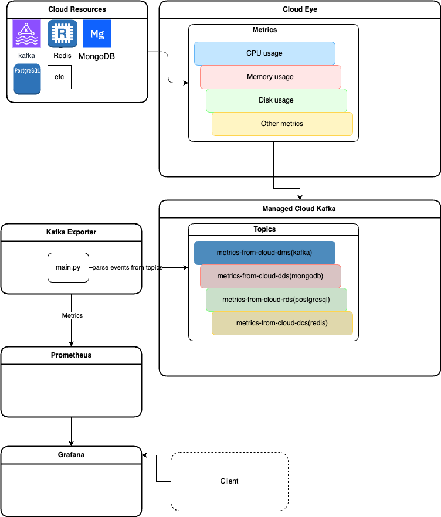

# Kafka Exporter для Prometheus (SberCloud)


## Описание проекта

Этот проект предоставляет решение для мониторинга кластера Apache Kafka, развернутого в облаке **SberCloud**, с использованием Prometheus и Grafana. В основе проекта лежит **Kafka Exporter** — инструмент, который собирает метрики Kafka (например, количество брокеров, оффсеты топиков, лаг консьюмер-групп) и экспортирует их в формате, совместимом с Prometheus. Проект включает:

- Helm chart для развертывания Kafka Exporter в Kubernetes.
- Dockerfile для создания Docker-образа Kafka Exporter.
- Python-скрипт для получения параметров Kafka-инстанса из SberCloud API и настройки переменных окружения.
- Конфигурации для интеграции с Prometheus и Grafana.

Цель проекта — обеспечить мониторинг состояния Kafka-кластера в SberCloud, включая метрики брокеров, топиков, партиций и консьюмер-групп, с возможностью визуализации данных в Grafana.

**Важно**: Проект разработан специально для работы с облачной платформой SberCloud и использует её API для получения информации о Kafka-инстансах, а также Cloud Eye и Managed Cloud Kafka.

## Архитектура

- **Kafka Exporter**: Служба, которая подключается к Kafka-кластеру в SberCloud, собирает метрики (например, `kafka_brokers`, `kafka_topic_partition_current_offset`, `kafka_consumergroup_lag`) и предоставляет их через HTTP-эндпоинт `/metrics` для Prometheus.
- **Python-скрипт**: Получает параметры Kafka-инстанса (адрес брокеров, имя пользователя) через SberCloud API, используя авторизацию по токену, и записывает их в переменные окружения (`AMAZME_KAFKA_URL`, `AMAZME_KAFKA_USER`) и файл `kafka_env.sh`.
- **Prometheus**: Система мониторинга, которая периодически запрашивает метрики у Kafka Exporter и сохраняет их для анализа.
- **Grafana**: Инструмент визуализации, который подключается к Prometheus для создания дашбордов с графиками метрик Kafka.
- **Helm Chart**: Упрощает развертывание Kafka Exporter в Kubernetes, включая конфигурацию сервиса, деплоя и интеграцию с Prometheus через ServiceMonitor.
- **Docker**: Используется для контейнеризации Kafka Exporter, обеспечивая переносимость и простоту развертывания.

## Зависимости

Для работы проекта требуются следующие инструменты и компоненты:

- **Docker** (версия ≥ 20.10): Для сборки и запуска контейнера Kafka Exporter.
- **Kubernetes** (версия ≥ 1.22): Для развертывания Helm chart.
- **Helm** (версия ≥ 3.9): Для установки чарта в Kubernetes.
- **Apache Kafka** (версия ≥ 0.10.1.0): Кластер Kafka, развернутый в SberCloud.
- **Prometheus** (версия ≥ 2.37): Для сбора и хранения метрик.
- **Grafana** (версия ≥ 9.0): Для визуализации метрик (опционально).
- **kubectl**: Для взаимодействия с Kubernetes-кластером.
- **SberCloud аккаунт**: Для доступа к API IAM и DMS (Distributed Message Service) для получения информации о Kafka-инстансах.

Дополнительные зависимости:
- Python-библиотеки (указаны в Python-скрипте): `requests`, `os`, `json`.
- Docker-образ `danielqsj/kafka-exporter` (версия `latest` или указанная в `values.yaml`).

## Установка

### 1. Клонирование репозитория
Склонируйте репозиторий на локальную машину:
```bash
git clone https://github.com/ZhdanAndrew/kafka-exporter-to-prometheus.git
cd kafka-exporter-to-prometheus
```

### 2. Сборка Docker-образа
Соберите Docker-образ Kafka Exporter:
```bash
docker build -t kafka-exporter:latest .
```

(Опционально) Загрузите образ в реестр, если требуется:
```bash
docker tag kafka-exporter:latest <your-registry>/kafka-exporter:latest
docker push <your-registry>/kafka-exporter:latest
```

### 3. Настройка Python-скрипта
Python-скрипт (`script.py`) используется для получения параметров Kafka-инстанса из SberCloud API. Для его работы необходимо задать следующие переменные окружения:

- `PROJECT_NAME`: Название проекта в SberCloud (например, `ru-moscow-1_<project_name>`).
- `AMAZME_KAFKA_PASSWORD`: Пароль для доступа к Kafka-инстансу.
- `AMAZME_KAFKA_INSTANCE_NAME`: Имя Kafka-инстанса в SberCloud (например, `dms-kafka-platform-<tenant>-<env>`).

Также замените следующие константы в скрипте:
- `USERNAME`: Имя пользователя SberCloud.
- `PASSWORD`: Пароль пользователя SberCloud.
- `DOMAIN_NAME`: Домен SberCloud (обычно `ru-moscow-1`).

Скрипт выполняет следующие действия:
1. Получает аутентификационный токен через SberCloud IAM API.
2. Запрашивает ID проекта.
3. Получает список Kafka-инстансов через SberCloud DMS API.
4. Находит указанный Kafka-инстанс по имени.
5. Извлекает параметры (`kafka_broker`, `kafka_username`) и записывает их в переменные окружения и файл `/app/kafka_env.sh`.

### 4. Настройка Helm chart
Отредактируйте файл `helm-chart/values.yaml`, чтобы указать параметры подключения к Kafka-кластеру:
- `kafka.server`: Адрес Kafka-брокера (получается из Python-скрипта или задаётся вручную, например, `kafka:9092`).
- `image.repository` и `image.tag`: Укажите имя и тег Docker-образа, если используете собственный реестр.
- `serviceMonitor.enabled`: Установите `true`, если Prometheus Operator установлен в кластере.

Пример конфигурации в `values.yaml`:
```yaml
image:
  repository: kafka-exporter
  tag: latest
kafka:
  server: kafka:9092
serviceMonitor:
  enabled: true
  namespace: monitoring
```

### 5. Деплой в Kubernetes
Для развертывания Helm chart выполните следующие шаги:

1. Упакуйте Helm chart:
   ```bash
   helm package ./k8s/helm/cloud-kafka-exporter/
   ```

2. Переключитесь на нужный Kubernetes-контекст (замените `{{tenant}}` и `{{env}}` на соответствующие значения):
   ```bash
   kubectl config use-context {{tenant}}-{{env}}
   ```

3. Установите или обновите Helm chart в namespace `monitoring`:
   ```bash
   helm upgrade -i cloud-kafka-exporter cloud-kafka-exporter/cloud-kafka-exporter -n monitoring \
     --set env.PROJECT_NAME="ru-moscow-1_{{project_name}}" \
     --set env.AMAZME_KAFKA_PASSWORD="{{KAFKA_PASS}}" \
     --set env.AMAZME_KAFKA_INSTANCE_NAME="dms-kafka-platform-{{tenant}}-{{env}}"
   ```

   - `{{project_name}}`: Название проекта в SberCloud.
   - `{{KAFKA_PASS}}`: Пароль для Kafka-инстанса.
   - `{{tenant}}` и `{{env}}`: Идентификаторы тенанта и окружения (например, `prod`, `dev`).

### 6. Проверка развертывания
Убедитесь, что поды Kafka Exporter запущены:
```bash
kubectl get pods -n monitoring
```

Проверьте, что Prometheus собирает метрики, открыв веб-интерфейс Prometheus (обычно `http://<prometheus-host>:9090/targets`) и убедившись, что `kafka-exporter` отображается в списке целей.

### 7. Настройка Grafana (опционально)
1. Добавьте Prometheus как источник данных в Grafana.
2. Импортируйте дашборд Grafana с ID `7589` (Kafka Exporter Overview) или создайте собственный дашборд, используя метрики, такие как:
   - `kafka_brokers`: Количество брокеров в кластере.
   - `kafka_topic_partition_current_offset`: Текущий оффсет топика/партиции.
   - `kafka_consumergroup_lag`: Лаг консьюмер-группы.

## Использование

После развертывания Kafka Exporter начинает собирать метрики и предоставлять их по адресу `http://<kafka-exporter-host>:9308/metrics`. Prometheus автоматически запрашивает эти метрики (если настроен ServiceMonitor или статическая конфигурация).

Примеры метрик, которые можно визуализировать:
- Количество активных брокеров: `kafka_brokers`.
- Лаг консьюмер-группы: `kafka_consumergroup_lag{topic="my-topic",consumergroup="my-group"}`.
- Состояние реплик: `kafka_topic_partition_in_sync_replica`.

Для анализа метрик используйте Grafana, создав дашборды с нужными запросами PromQL.

## Структура Helm Chart

- `Chart.yaml`: Метаданные чарта, включая имя, версию и описание.
- `values.yaml`: Конфигурируемые параметры (например, адрес Kafka, настройки сервиса).
- `templates/`:
  - `deployment.yaml`: Описание Kubernetes Deployment для Kafka Exporter.
  - `service.yaml`: Service для доступа к Exporter.
  - `servicemonitor.yaml`: ServiceMonitor для интеграции с Prometheus Operator.
- `templates/_helpers.tpl`: Вспомогательные шаблоны Helm.

## Дополнительные замечания

- **SberCloud API**: Python-скрипт взаимодействует с IAM и DMS API SberCloud. Убедитесь, что у пользователя есть права на доступ к проектам и Kafka-инстансам.
- **Безопасность**: Храните пароли (`AMAZME_KAFKA_PASSWORD`, `PASSWORD`) в безопасном месте, например, в Kubernetes Secrets или менеджерах секретов (Vault).
- **Масштабируемость**: Helm chart поддерживает настройку количества реплик через `replicaCount` в `values.yaml`.
- **Логирование**: Kafka Exporter поддерживает уровни логирования (`debug`, `info`, `warn`, `error`, `fatal`), которые можно настроить через аргументы в `values.yaml` (поле `extraArgs`).
- **Документация**: Подробная информация о метриках доступна в документации Apache Kafka и репозитории `danielqsj/kafka_exporter`.

## Лицензия

Проект распространяется под лицензией Apache License 2.0.